# JARVIS - Just A Rather Verbose Imitation of Stark

> **Experimental** This is a highly experimental real-time voice assistant with MCP tool calling capability. Not for production use

A streaming voice agent that enables natural conversations with an LLM while supporting tool use. The system is full-duplex, meaning you can interrupt the agent mid-speech (barge-in), and it processes your voice input while simultaneously generating audio responses.

## Architecture

```mermaid
flowchart TB
    subgraph Browser
        Mic["🎤 Microphone<br/>(16kHz)"]
        VAD["VAD<br/>(ricky0123)"]
        Playback["🔊 Web Audio Playback<br/>(24kHz)"]
        Mic --> VAD
    end

    subgraph Server["Voice Agent Server"]
        ASR["ASR Engine<br/>(Whisper)<br/>cuda:0"]
        Agent["MCP Agent<br/>(vLLM)"]
        TTS["TTS Engine<br/>(VibeVoice)<br/>cuda:1"]
        Tools["MCP Tools<br/>• Web Search<br/>• Playwright"]

        ASR --> Agent
        Agent --> TTS
        Agent --> Tools
    end

    VAD -->|WebSocket| ASR
    TTS -->|WebSocket| Playback
```



### Components

**Voice Input Pipeline**
- Browser captures audio via WebAudio API at 16kHz
- Client-side Voice Activity Detection (VAD) filters silence
- Audio streams over WebSocket to server
- Whisper Large V3 Turbo transcribes speech to text

**Agent Processing**
- vLLM serves Devstral-24B with streaming token generation
- MCP protocol enables tool calling (web search, browser automation)
- Streaming architecture allows TTS to begin before response completes

**Voice Output Pipeline**
- VibeVoice synthesizes speech in real-time as tokens arrive
- Audio chunks stream back to browser via WebSocket
- ~300ms latency to first audible output
- Barge-in detection stops playback when user speaks

## Hardware Requirements

| Component | Minimum Requirement |
|-----------|---------------------|
| GPU | 2x NVIDIA GPUs with 24GB VRAM each (RTX 3090, RTX 4090, or equivalent) |
| CUDA | Version 12.4+ |
| RAM | 32GB |
| Storage | ~40GB for model weights |
| Audio | Microphone and speakers (accessed via browser) |

### GPU Memory Allocation

- **GPU 0 (cuda:0)**: ASR (Whisper) ~6GB + vLLM ~17GB
- **GPU 1 (cuda:1)**: TTS (VibeVoice) ~3GB + vLLM ~17GB

The LLM runs in tensor-parallel mode across both GPUs.

## Quick Start

1. Clone the repository with submodules:
   ```bash
   git clone --recursive https://github.com/your-repo/jarvis.git
   cd jarvis
   ```

2. Copy and customize the configuration:
   ```bash
   cp mcp_agent_config.example.json mcp_agent_config.json
   # Edit mcp_agent_config.json with your settings
   ```

3. Start with Docker Compose:
   ```bash
   docker compose up -d
   ```

4. Open `http://localhost:3000` in your browser and grant microphone access.

## Configuration

All configuration is in `mcp_agent_config.json`:

- **llm**: LLM endpoint URL, model name, and generation settings
- **mcp_servers**: Tool servers (Playwright, SearXNG, etc.) with optional environment variables
- **agent**: System prompt and max reasoning steps
- **voice**: ASR/TTS models, devices, and audio settings

Example MCP server with environment variables:
```json
{
  "name": "searxng",
  "type": "stdio",
  "command": "npx -y mcp-searxng",
  "env": {
    "SEARXNG_URL": "https://your-searxng-instance.example.com"
  }
}
```

